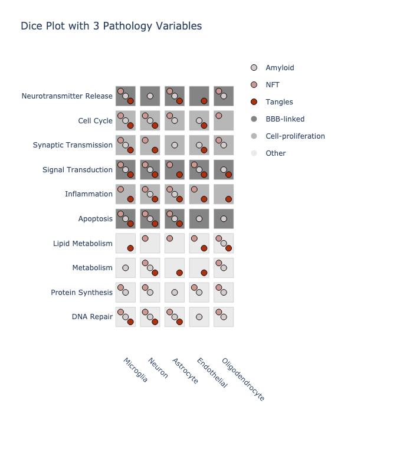
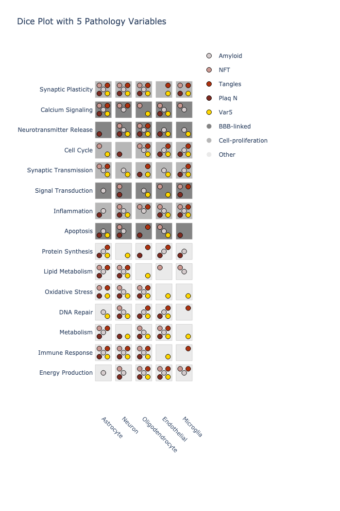

# pyDicePlot

The **pyDicePlot** package allows you to create visualizations (dice plots) for datasets with more than two categorical variables and additional continuous variables. This tool is particularly useful for exploring complex categorical data and their relationships with continuous variables.

## Requirements
This code requires python 3.
```bash
conda create --name pydiceplot python=3
conda activate pydiceplot
pip install -r requirements.txt
```

Installation via pip
To install the package via pip, run
```bash
pip install -e .
```
from the base directory.

## Use the dice plots in R
for using dice plots in R please refer to [DicePlot](https://github.com/maflot/DicePlot/tree/main)

## Sample Output




*Figure: A sample dice plot generated using the `DicePlot` package.*

## Documentation

For full documentation and additional examples, please refer to the [documentation](https://dice-and-domino-plot.readthedocs.io/en/latest/index.html#)
## Features

- **Visualize Complex Data:** Easily create plots for datasets with multiple categorical variables.
- **Customization:** Customize plots with titles, labels, and themes.
- **Integration with ggplot2:** Leverages the power of `ggplot2` for advanced plotting capabilities.

## Contributing

We welcome contributions from the community! If you'd like to contribute:

1. Fork the repository on GitHub.
2. Create a new branch for your feature or bug fix.
3. Submit a pull request with a detailed description of your changes.

## Contact

If you have any questions, suggestions, or issues, please open an issue on GitHub.