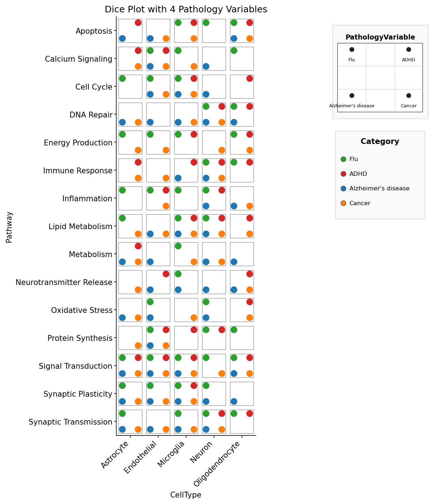
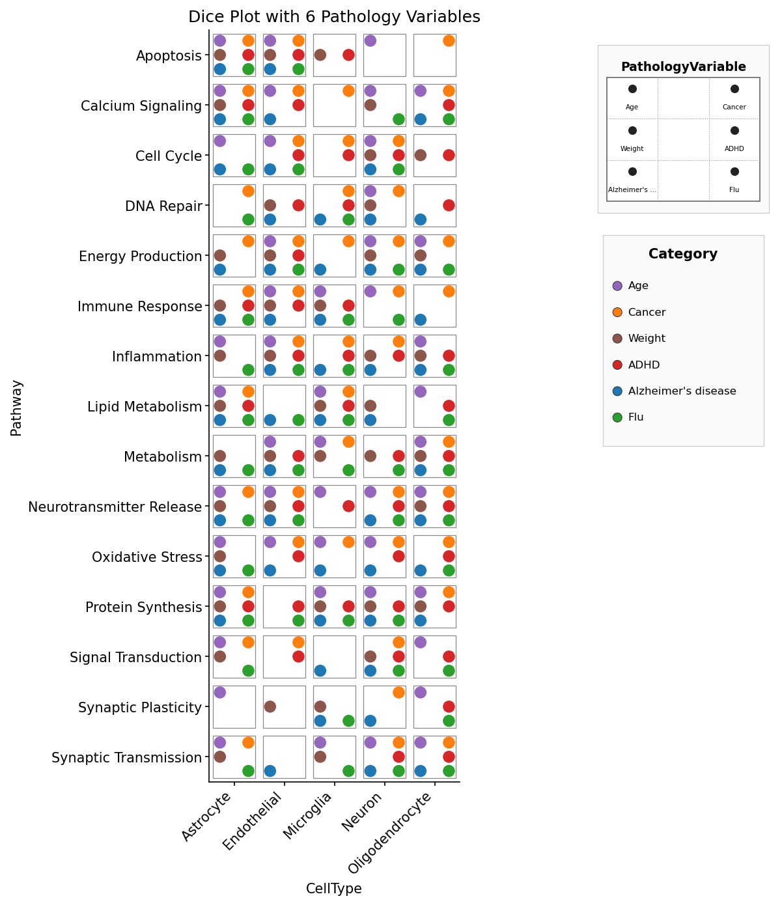
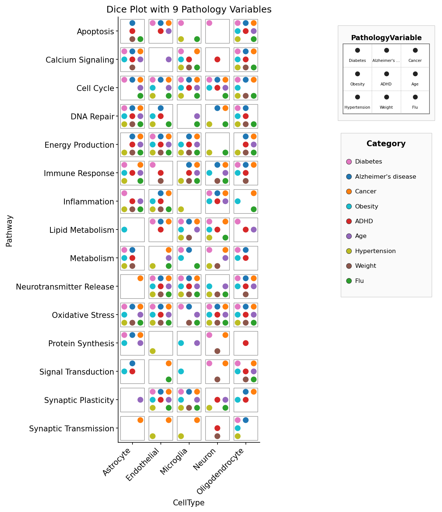
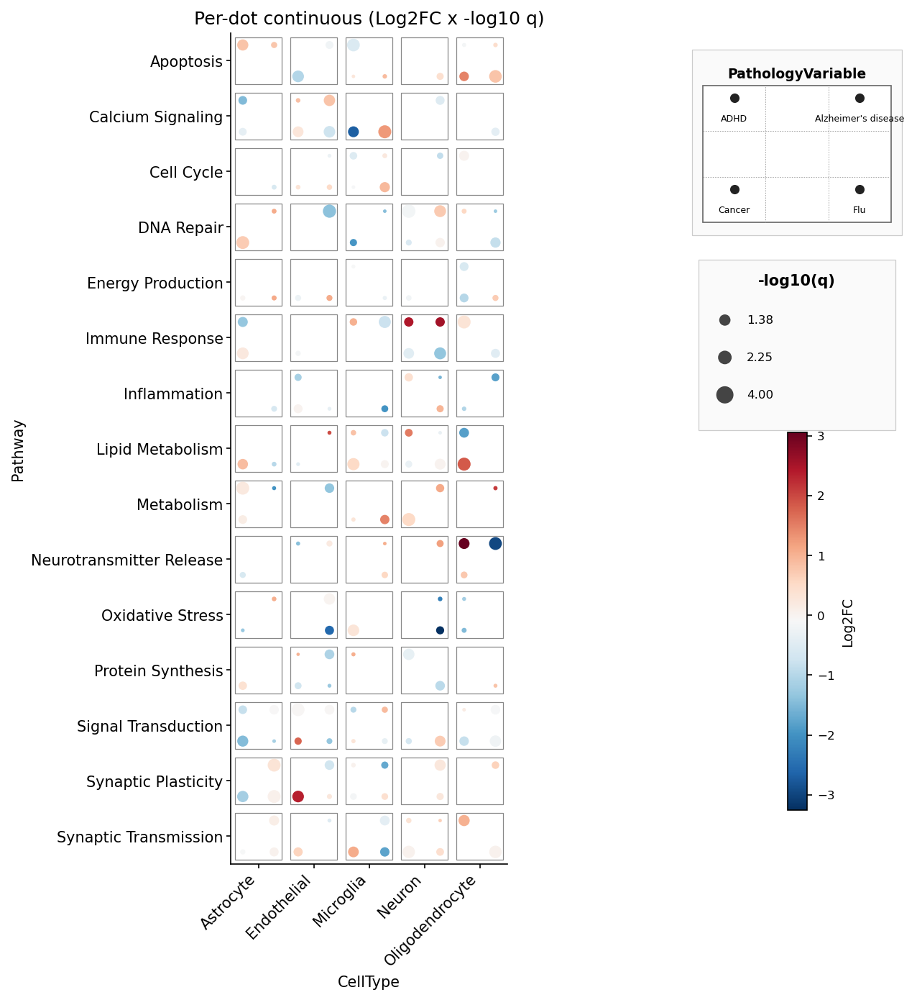

# pydiceplot

[](https://pypi.org/project/pydiceplot/)


**pydiceplot** creates dice plots — grids of dice-face icons that encode up
to six categorical variables (one per pip slot) plus optional continuous
fill and size mappings. It supports both `matplotlib` and `plotly` backends
and is the Python sibling of the R package
[`ggdiceplot`](https://github.com/maflot/ggdiceplot).

The grid geometry and legend stack are ports of
[`kuva`](https://github.com/Psy-Fer/kuva)'s `DicePlot`, which itself is a
port of `ggdiceplot`'s `geom_dice` — so all three packages produce the same
visual layout.

## Sample output

The three images below are produced by `example_code/example.py`. Regenerate
them at any time with `pixi run example`.









## Install

```bash
pip install pydiceplot
```

Or, for development against this repo:

```bash
git clone https://github.com/maflot/pyDicePlot.git
cd pyDicePlot
pixi install      # or: pip install -e .
pixi run test     # 25 tests
pixi run example  # writes plots to ./plots
```

## Modes

A dice plot has **three input modes**, picked by which arguments you pass:

| Mode | Trigger | What each pip shows |
|------|---------|---------------------|
| **Categorical** | pass `cat_c_colors={label: hex, ...}` | filled circle in its category colour when present |
| **Per-dot continuous** | pass `fill_col` and/or `size_col` | continuous colour and/or size from numeric columns |
| Tile | (advanced) — wrap a one-row-per-tile DataFrame | one continuous value per tile |

The legend stack (right-hand column) always includes a **position legend**
showing which pip slot maps to which category, plus a colorbar/size legend
when relevant. This matches `ggdiceplot::draw_key` semantics.

## Categorical mode

```python
import pydiceplot
from pydiceplot import dice_plot
from pydiceplot.plots.backends._dice_utils import (
    get_diceplot_example_data, get_example_cat_c_colors,
)

pydiceplot.set_backend("matplotlib")  # or "plotly"

data = get_diceplot_example_data(4)
colors = dict(list(get_example_cat_c_colors().items())[:4])

fig = dice_plot(
    data=data,
    cat_a="CellType",
    cat_b="Pathway",
    cat_c="PathologyVariable",
    cat_c_colors=colors,
    title="Dice Plot with 4 Pathology Variables",
)
fig.save("./plots", "dice_4", formats=".png")
```

## Per-dot continuous mode

This mirrors ggdiceplot's `geom_dice(aes(dots=cat_c, fill=lfc, size=-log10(q)))`:

```python
import numpy as np
import pydiceplot
from pydiceplot import dice_plot
from pydiceplot.plots.backends._dice_utils import get_diceplot_example_data

pydiceplot.set_backend("matplotlib")

rng = np.random.default_rng(1)
data = get_diceplot_example_data(4)
data["lfc"] = rng.normal(0, 1.2, len(data))
data["nlq"] = rng.uniform(0.5, 4, len(data))

fig = dice_plot(
    data=data,
    cat_a="CellType",
    cat_b="Pathway",
    cat_c="PathologyVariable",
    fill_col="lfc",
    size_col="nlq",
    fill_legend_label="Log2FC",
    size_legend_label="-log10(q)",
    color_map="RdBu_r",
    title="Per-dot continuous",
)
fig.save("./plots", "dice_continuous", formats=".png")
```

## API

### `dice_plot()`

```python
dice_plot(
    data, cat_a, cat_b, cat_c, *,
    # Mode selection
    cat_c_colors=None,        # dict → categorical mode
    fill_col=None,            # str → continuous per-pip fill
    size_col=None,            # str → continuous per-pip size
    # Ordering
    cat_a_order=None, cat_b_order=None, switch_axis=False,
    # Dice shape
    ndots=None, pip_scale=0.85, cell_width=0.85, cell_height=0.85,
    grid_lines=False,
    # Color scales
    fill_range=None, size_range=None, color_map="viridis",
    # Labels
    title=None,
    cat_a_labs=None, cat_b_labs=None, cat_c_labs=None,
    fill_legend_label=None, size_legend_label=None, position_legend_label=None,
    # Dimensions (inches for matplotlib, pixels for plotly)
    fig_width=None, fig_height=None,
    max_dice_sides=6,
)
```

`dice_plot` returns an object with `.show()` and `.save(path, name, formats)`
methods. The active backend is selected via `pydiceplot.set_backend(...)`.

### Pip slot layout

The 3×3 pip grid uses a column-major reading order so that dice faces match
ggdiceplot exactly:

```
pos 1 (TL)  pos 4 (TM)  pos 7 (TR)
pos 2 (ML)  pos 5 (MM)  pos 8 (MR)
pos 3 (BL)  pos 6 (BM)  pos 9 (BR)
```

Dice sizes pick from this table (traditional die faces; n=6 is two vertical
columns, not two horizontal rows — this is where we deliberately diverge from
`ggdiceplot::make_offsets`, which renders the transposed layout):

| n | positions | visual |
|---|-----------|--------|
| 1 | `[5]` | center |
| 2 | `[1, 9]` | diagonal (TL + BR) |
| 3 | `[1, 5, 9]` | diagonal + center |
| 4 | `[1, 3, 7, 9]` | four corners |
| 5 | `[1, 3, 5, 7, 9]` | corners + center |
| 6 | `[1, 3, 4, 6, 7, 9]` | two vertical columns |
| 7 | `[1, 3, 4, 5, 6, 7, 9]` | 6 + center |
| 8 | `[1, 2, 3, 4, 6, 7, 8, 9]` | 3×3 minus center |
| 9 | `[1, 2, 3, 4, 5, 6, 7, 8, 9]` | fully populated 3×3 |

## Citation

If you use this package, please cite:

> M. Flotho, P. Flotho, A. Keller, "DicePlot: a package for high-dimensional categorical data visualization," *Bioinformatics*, vol. 42, no. 2, btaf337, 2026.

```bibtex
@article{flotho2026diceplot,
  title   = {DicePlot: a package for high-dimensional categorical data visualization},
  author  = {Flotho, Matthias and Flotho, Philipp and Keller, Andreas},
  journal = {Bioinformatics},
  volume  = {42},
  number  = {2},
  pages   = {btaf337},
  year    = {2026},
  publisher = {Oxford University Press}
}
```

## Related packages

- [`ggdiceplot`](https://github.com/maflot/ggdiceplot) — the R / ggplot2 sibling
- [`kuva`](https://github.com/Psy-Fer/kuva) — a Rust plotting library that includes a dice plot

## License

MIT — see [`LICENSE`](LICENSE).
